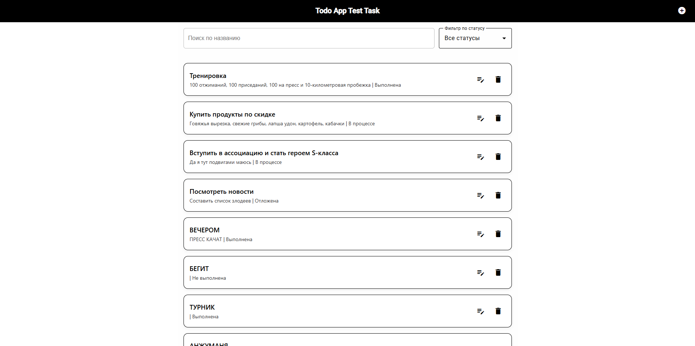
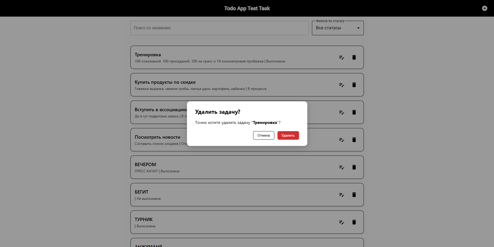

# 📝 Todo-App-Test-Task

> Простое, минималистичное Angular-приложение для управления задачами с использованием **Angular 19**, **Angular Material** и **Signals API**.

---

## 🚀 Live Demo

<p align="center">
  <a href="https://Bogdan-Afanasev.github.io/Todo-App-Test-Task" target="_blank">
    
  </a>
</p>

---

## 🎯 Функциональность

- ✅ Добавление, редактирование и удаление задач
- ✅ Фильтрация по статусу
- ✅ Поиск по названию
- ✅ Уведомления через `MatSnackBar`
- ✅ Подтверждение удаления
- ✅ Адаптивный интерфейс
- ✅ Использование Angular Signals + Standalone компонентов

---

## 📸 Скриншоты

### 💻 Desktop

| Список задач                      | Модальное окно удаления             |
| --------------------------------- | ----------------------------------- |
|  |  |

---

## 🛠️ Установка и запуск

```bash
# Клонируйте репозиторий
git clone https://github.com/Bogdan-Afanasev/Todo-App-Test-Task.git
cd Todo-App-Test-Task

# Установите зависимости
npm install

# Запустите приложение
ng serve
```

---

## 📦 Сборка продакшен-версии

```bash
ng build
```

---

## 🌍 Развёртывание на GitHub Pages

# Установи утилиту для деплоя

```bash
ng add angular-cli-ghpages

# Собери проект с нужным base-href (название репозитория)

ng build --base-href="/Todo-App-Test-Task/"

# Задеплой на GitHub Pages

npx angular-cli-ghpages --dir=dist/Todo-App-Test-Task

# После этого проект будет доступен по адресу:

https://your-username.github.io/Todo-App-Test-Task/
```

---

## 🗂️ Структура проекта

```
src/
├── app/
│ ├── components/
│ │ ├── add-task.component.ts
│ │ ├── edit-task.component.ts
│ │ ├── task-form.component.ts
│ │ ├── tasks-list.component.ts
│ │ └── toast.component.ts
│ ├── services/
│ │ └── api.service.ts
│ ├── model/
│ │ └── task.model.ts
├── styles.scss
└── main.ts
```

---

## 🧩 Используемые технологии

- Angular 19.1.5

- Angular Material 19.1.3

- CDK 19.1.3

- RxJS 7.8.x

- TypeScript 5.5.x

- Standalone Components

- Angular Signals API

- SCSS

---

## 🤝 Автор

[](https://github.com/Bogdan-Afanasev)  
**Богдан Афанасьев** — Frontend Developer / Fullstack Enthusiast / Philosopher-in-Progress  
[GitHub](https://github.com/Bogdan-Afanasev) | [Telegram](https://t.me/bogdan_afanasev_dev) | [Email](mailto:bogdan.way.00@gmail.com)

---

## ⚖️ Лицензия

Этот проект создан исключительно в учебных целях. Все использованные API, стили и технологии принадлежат их соответствующим владельцам. Проект не предназначен для коммерческого использования.

---

Наслаждайтесь — и не забудьте ⭐ звезду, если вам понравилось!
